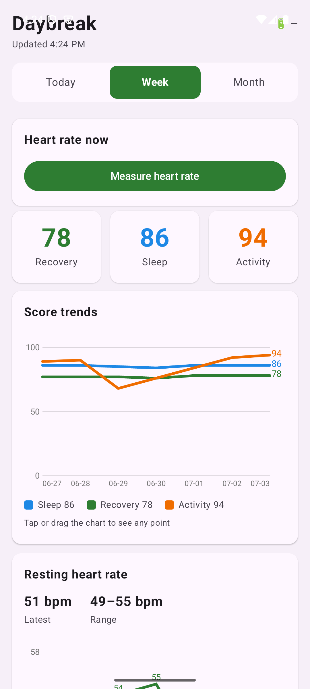
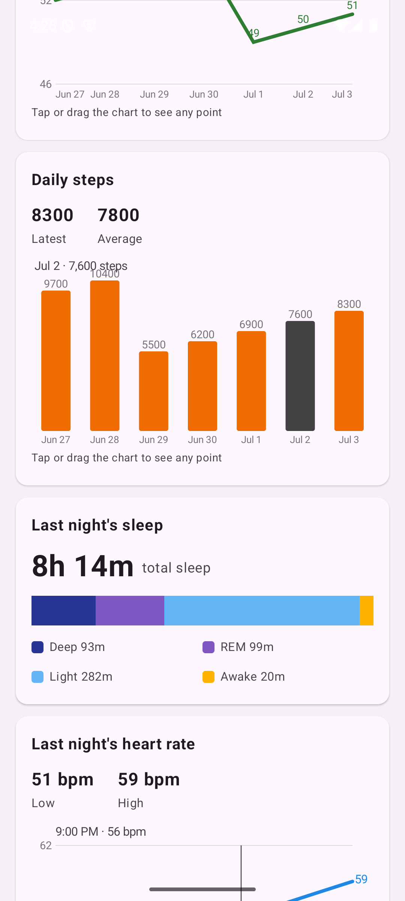
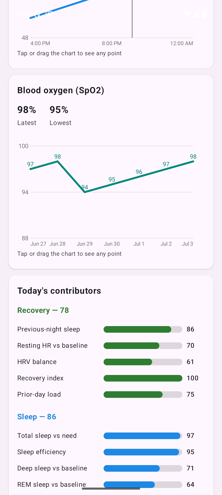
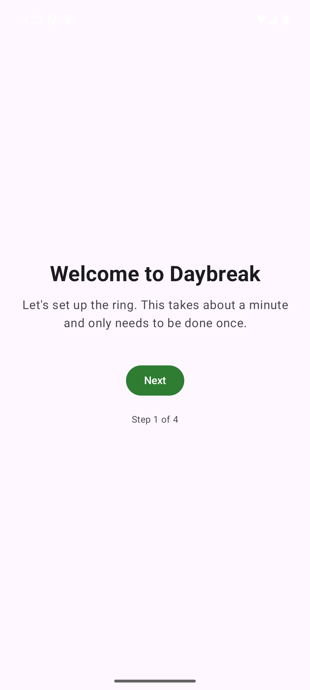

# Daybreak 🌅

> A custom-built Oura. Sleep, recovery, and activity scores computed entirely on your phone from a COLMI R09 smart ring: no cloud, no subscription, no account.

<p align="center">
  
  
  
  
  
  
</p>

---

## Table of Contents

- [Screenshots](#screenshots)
- [The Problem](#the-problem)
- [What Daybreak Does](#what-daybreak-does)
- [The Three Scores](#the-three-scores)
- [Features](#features)
- [Engineering Highlights](#engineering-highlights)
- [Architecture](#architecture)
- [Getting Started](#getting-started)
- [Running the Tests](#running-the-tests)
- [Project Layout](#project-layout)
- [Privacy](#privacy)
- [Disclaimer](#disclaimer)
- [License](#license)

---

## Screenshots

<p align="center">
  
  
  
  
</p>

<p align="center"><em>The three daily scores with trends · steps and sleep-stage breakdowns · SpO2 and score contributors · the one-time setup flow</em></p>

## The Problem

Wearable health tracking is genuinely useful. Knowing how you slept, and whether today is a "go hard" or "take it easy" day, changes behavior. But the mainstream option locks that insight behind premium hardware, a monthly subscription, and a cloud account that holds your biometric data.

Meanwhile, the COLMI R09, an unassuming smart ring with optical heart rate, SpO2, sleep staging, and step tracking, has been fully reverse-engineered by the open-source community. The sensors exist. The data is decodable. What's missing is the last mile: a clean, opinionated app that turns raw BLE packets into a single glanceable answer.

So I built my own Oura, end to end, for one real user: **my dad**. Non-technical, won't open settings, won't troubleshoot Bluetooth, won't interpret a graph. Success is measured by one thing: he glances at his phone each morning and understands, in words, how he slept and whether to take it easy today.

## What Daybreak Does

Daybreak talks directly to the ring over Bluetooth Low Energy using a protocol layer written from scratch against the reverse-engineered COLMI packet format. It syncs automatically in the background a few times a day, computes three daily 0-100 scores on-device, and presents them on a single home screen with a plain-language summary:

> *"You slept 7h 10m and recovered well. Good day to be active."*

Everything runs locally. **No account. No cloud. No subscription. The app doesn't even request network permission**, so your heart rate physically cannot leave your phone.

| | Oura | Daybreak |
|---|---|---|
| Hardware | Proprietary ring, premium price | Off-the-shelf smart ring, custom software |
| Subscription | Monthly fee | None, ever |
| Data location | Their cloud | 100% on your device |
| Daily scores | Sleep / Readiness / Activity | Sleep / Recovery / Activity |
| Scoring model | Proprietary | Open, documented in this repo |
| Works offline | Partially | Entirely |

## The Three Scores

All scores are weighted sums of normalized contributors, each scored against the wearer's **own rolling 14-night baseline**: trends over single readings. A calibration guard suppresses scores until baselines stabilize, so the first two weeks never surface a misleading number.

- 😴 **Sleep**: total sleep vs. an age-based need, efficiency, deep and REM proportions vs. baseline, restfulness, timing regularity, and latency.
- 🔋 **Recovery**: previous-night sleep, resting heart rate vs. baseline, HRV balance, a *recovery index* (how early in the night resting HR hit its low), and prior-day activity load. When the firmware doesn't expose HRV, its weight redistributes to resting HR and sleep instead of silently zero-filling. The score degrades gracefully, never dishonestly.
- 🏃 **Activity**: steps vs. a personalized goal (which lowers on low-recovery days), active minutes, sedentary penalties, and activity balance.

A rule-based generator turns the scores and their dominant drivers into one warm, non-clinical sentence. An optional **on-device LLM summarizer** (MediaPipe GenAI) can take over, still fully offline.

## Features

- 📡 **Zero-touch background sync**: WorkManager schedules a guaranteed morning window plus top-ups; catch-up logic backfills any missed night on the next successful connect. The wearer never presses "sync."
- 🛰️ **Full BLE protocol implementation**: 16-byte command packets with checksum validation, multi-packet "big data" reassembly for sleep records, and streaming assemblers for heart-rate logs, steps, and SpO2.
- 🧮 **Pure-Kotlin scoring engine**: no Android dependencies, fully unit-tested, portable to any platform.
- 🏠 **One-screen UX**: big type, color-coded with non-color cues, designed for an older non-technical wearer. No menus or tabs on the home screen.
- 📊 **Insights**: score trend charts, a last-night hypnogram, the overnight heart-rate curve with the nightly low marked, activity charts, and per-score contributor breakdowns, all drawn with Compose `Canvas`.
- ❤️ **On-demand heart rate**: tap to take a live reading from the ring.
- 🔕 **Invisible failure**: an out-of-range ring or a failed sync quietly shows yesterday's data. Never an error dialog after day one.
- 📤 **Local CSV export**: share your own data as a file; nothing is ever uploaded.
- 🔎 **Diagnostics screen**: sync logs and raw values for the maintainer, out of the wearer's way.

## Engineering Highlights

- **Reverse-engineered BLE protocol, cleanly rebuilt.** The `:protocol` module implements the COLMI R0x packet format (checksum = low byte of the sum of the first 15 bytes), BCD date encoding, and the `0xBC` big-data characteristic's chunked transfer, verified against Gadgetbridge's parser and validated on real hardware.
- **Strict modular architecture.** `:protocol` and `:scoring` are pure JVM Kotlin modules with zero Android dependencies. The `:app` module wires them to Room, WorkManager, and Compose through a `RingClient` interface with a real BLE implementation and a no-op test double.
- **Graceful degradation as a design principle.** Budget-ring hardware is honest about its limits: no temperature sensor, firmware-dependent HRV, noisy sleep staging. The scoring model explicitly reweights around missing signals rather than pretending they exist.
- **Resilience against Android's background restrictions.** Doze-aware scheduling, boot receivers, retry and backoff policies, and a morning-sync policy tested as pure logic.
- **~30 unit test files across all three modules** covering packet encoding, reassembly edge cases, every score's contributor math, the HRV-absent fallback, catch-up sync windows, and summary generation.
- **Product thinking documented.** The full [product requirements document](Daybreak_PRD.md), including the hardware capability matrix, scoring weights, UX principles, and risk analysis, lives in the repo.

## Architecture

```
┌─────────────────────────────────────────────────────────────┐
│                       :app  (Android)                       │
│                                                              │
│  Compose UI          Sync                 Data               │
│  ┌────────────┐     ┌───────────────┐    ┌────────────────┐  │
│  │ Home        │     │ SyncWorker    │    │ Room database  │  │
│  │ Insights    │◄────┤ SyncScheduler ├───►│ Repository     │  │
│  │ Onboarding  │     │ CatchUp       │    │ SettingsStore  │  │
│  │ Diagnostics │     │ MorningPolicy │    │ CSV export     │  │
│  └────────────┘     └───────┬───────┘    └────────────────┘  │
│                             │                                 │
│                     ┌───────▼───────┐                         │
│                     │  RingClient   │  (BLE state machine)    │
│                     └───────┬───────┘                         │
└─────────────────────────────┼─────────────────────────────────┘
                              │
        ┌─────────────────────┼──────────────────────┐
        │                     │                      │
┌───────▼────────┐    ┌───────▼────────┐             │ BLE
│   :protocol    │    │   :scoring     │             ▼
│  (pure Kotlin) │    │  (pure Kotlin) │      ┌─────────────┐
│                │    │                │      │  COLMI R09   │
│ Packet codec   │    │ SleepScore     │      │  smart ring  │
│ Big-data       │    │ RecoveryScore  │      └─────────────┘
│  reassembly    │    │ ActivityScore  │
│ Sleep/HR/SpO2/ │    │ Baselines      │
│  steps parsers │    │ SummaryGen     │
└────────────────┘    └────────────────┘
```

| Layer | Technology |
|---|---|
| Language | Kotlin 2.x, coroutines + Flow |
| UI | Jetpack Compose, Material 3, custom `Canvas` charts |
| Persistence | Room (SQLite), local settings store |
| Background work | WorkManager + boot receiver + Doze handling |
| Connectivity | Android BLE, custom COLMI R0x protocol layer |
| On-device AI (optional) | MediaPipe Tasks GenAI |
| Build | Gradle 8.11 (Kotlin DSL), version catalog, KSP |

## Getting Started

### Prerequisites

- **JDK 17+** (JDK 21 recommended)
- **Android SDK** with API 35 (command-line tools or Android Studio)
- An Android phone running **Android 8.0+**
- A **COLMI R09** smart ring (the app runs without one, but there's nothing to sync)

### Build

```bash
git clone https://github.com/reuhenbhalod/DayBreak.git
cd DayBreak

# Point Gradle at a supported JDK if your default differs, e.g. on macOS:
export JAVA_HOME=$(/usr/libexec/java_home -v 21)

./gradlew :app:assembleDebug
```

The APK lands in `app/build/outputs/apk/debug/`.

### Install & pair

```bash
adb install app/build/outputs/apk/debug/app-debug.apk
```

1. Open Daybreak and walk through onboarding: grant the Bluetooth and nearby-devices permissions and the battery-optimization exemption (this keeps background sync alive through Doze).
2. Scan for the ring and pair. One time, ever.
3. Set the wearer's age and sleep need.
4. Done. Scores appear as data accumulates; full scoring unlocks after the 14-night calibration period.

## Running the Tests

The protocol codec and the entire scoring model are pure JVM modules, so the test suite runs fast with no emulator:

```bash
./gradlew :protocol:test :scoring:test :app:testDebugUnitTest
```

## Project Layout

```
DayBreak/
├── app/                        # Android app (Compose UI, Room, WorkManager, BLE client)
│   └── src/main/kotlin/com/daybreak/
│       ├── ble/                # RingClient interface + real & no-op implementations
│       ├── data/               # Room entities, DAOs, repository, settings
│       ├── export/             # Local CSV export
│       ├── summary/            # Rule-based + optional on-device LLM summarizer
│       ├── sync/               # WorkManager sync, catch-up, morning policy, boot receiver
│       └── ui/                 # Home, Insights, Onboarding, Diagnostics, custom charts
├── protocol/                   # Pure-Kotlin COLMI R0x BLE protocol layer
│   └── src/main/kotlin/com/daybreak/protocol/
│       ├── Packet.kt           # 16-byte packet codec + checksum
│       ├── BigDataReassembler.kt  # Multi-packet 0xBC payload reassembly
│       └── ...                 # Sleep, HR-log, SpO2, and steps parsers
├── scoring/                    # Pure-Kotlin scoring engine (no Android deps)
│   └── src/main/kotlin/com/daybreak/scoring/
│       ├── SleepScore.kt · RecoveryScore.kt · ActivityScore.kt
│       ├── Baselines.kt        # Rolling personal baselines
│       └── SummaryGenerator.kt # Plain-language daily summary
├── docs/screenshots/           # App screenshots used in this README
└── Daybreak_PRD.md             # Full product requirements document
```

## Privacy

Daybreak is local-first by construction, not by policy:

- **No network permission** is requested in v1, so the OS itself guarantees nothing is uploaded.
- No accounts, no analytics, no telemetry.
- All data lives in a local SQLite database on the phone.
- The only way data leaves the device is if *you* export a CSV and share it.

## Disclaimer

Daybreak is an independent, Oura-*inspired* project. It is not affiliated with or endorsed by Oura, does not use Oura's branding or algorithms, and implements its own open scoring model. It is a **wellness tool, not a medical device**. Nothing it shows is a diagnosis.

## License

Released under the [MIT License](LICENSE).

---

<p align="center">Built with ❤️ by <a href="https://github.com/reuhenbhalod">Reuhen Bhalod</a></p>
